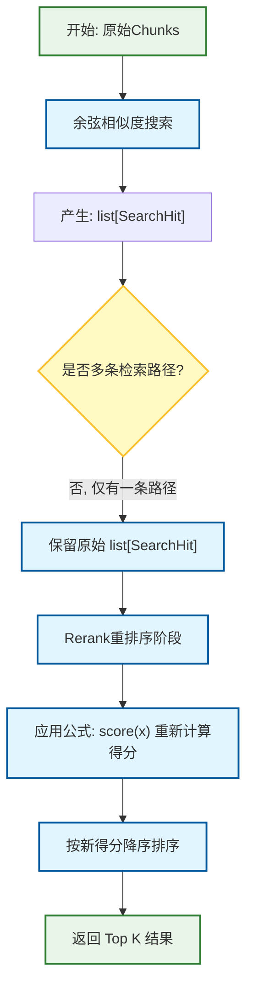
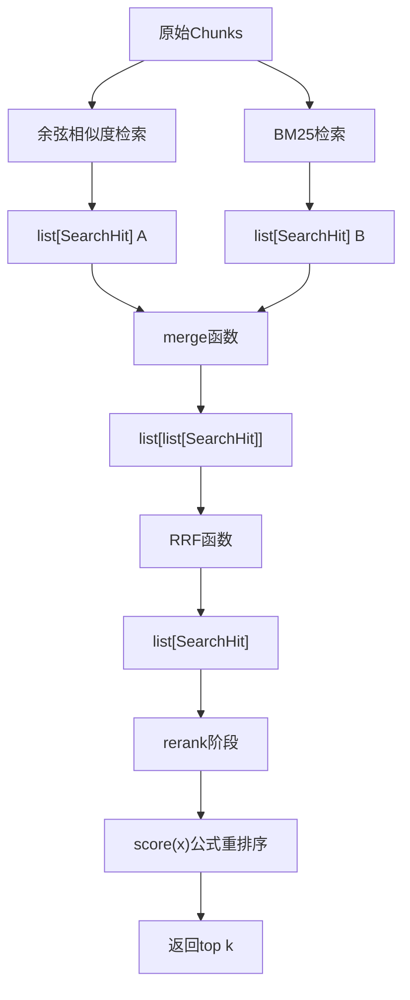
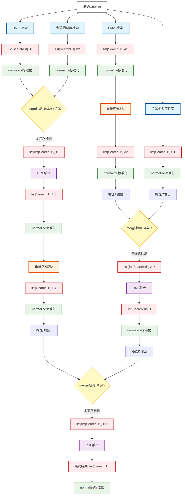

# 检索-重排序 拓扑抽象决策范例文档

初步决策见 @backend/docs/design.md

你需要在满足如下需求的前提下拟定Pipeline的实现计划

## 基本规则

### 一、核心元素定义

#### 1. 基础数据结构
- `Chunk`：系统处理的原始数据单元
- `SearchHit`：包含 `(chunk_id, score)` 的数据结构，是通路级别的基本输出单元
- `list[SearchHit]`：单条通路的标准输出格式
- `list[list[SearchHit]]`：多条通路结果合并后的复合结构，作为 RRF 的输入

#### 2. 操作算子
- **检索算子 (Retriever)**
  - **输入**：`Chunk`
  - **输出**：`list[SearchHit]`
  - **语义**：对 `Chunk` 执行某种相似度/相关性检索，为每个结果分配初始分数
  - **特性**：可存在多种不同算法实现的检索算子实例
- **重排序算子 (Reranker)**
  - **输入**：`list[SearchHit]`
  - **输出**：`list[SearchHit]`
  - **语义**：对检索结果应用某种评分函数重新计算分数，改变原有排序
  - **特性**：可存在多种不同算法实现的重排序算子实例
- **标准化算子 (Normalizer)**
  - **输入**：`list[SearchHit]`
  - **输出**：`list[SearchHit]`
  - **语义**：将列表中所有 `SearchHit.score` 通过 min-max 映射到 `[0, 1]` 区间
  - **约束**：强制跟随在每个产生 `list[SearchHit]` 的操作之后
- **合并检测算子 (MergeDetector)**
  - **输入**：多个 `list[SearchHit]`
  - **输出**：`list[list[SearchHit]]`
  - **语义**：检测输入通路的数量，当存在多条通路时，将结果包装为复合结构
  - **触发条件**：输入通路数量 > 1
- **分数融合算子 (RRF)**
  - **输入**：`list[list[SearchHit]]`
  - **输出**：`list[SearchHit]`
  - **语义**：应用 RRF (Reciprocal Rank Fusion) 算法，将多条通路的分数融合为单一分数列表

### 二、编排规则

#### 1. 通路定义规则
一条检索通路由以下序列构成：
```text
检索算子 → Normalizer
```
一条重排序通路由以下序列构成：
```text
重排序算子 → Normalizer
```
一条复合通路可由检索通路和重排序通路以任意顺序组合而成。

#### 2. 融合规则
当多条同级通路汇聚到同一节点时，必须经过：
```text
MergeDetector → RRF → Normalizer
```
融合后的结果作为新的 `list[SearchHit]`，可继续参与后续的重排序或再次融合。

#### 3. 标准化约束规则
任何产生 `list[SearchHit]` 的操作后，必须立即跟随 `Normalizer` 算子。
标准化后的列表方可作为输入进入下一操作。

#### 4. 拓扑执行规则
- 工作流定义为有向无环图 (DAG)
- 节点间依赖关系决定执行顺序
- 默认按拓扑排序串行执行（不启用并行）
- 数据沿有向边流动，每个节点的输出作为下游节点的输入

### 三、抽象表达能力
该模型能够表达以下编排模式：

#### 单路检索
```text
Chunk → Retriever → Normalizer → (可选的Reranker → Normalizer) → 输出
```

#### 多路检索融合
```text
Chunk → RetrieverA → Normalizer → MergeDetector → RRF → Normalizer → 输出
Chunk → RetrieverB → Normalizer ↗ 
```

#### 检索-重排序级联
```text
Chunk → Retriever → Normalizer → Reranker → Normalizer → 输出
```

#### 多路融合后重排序
```text
Chunk → RetrieverA → Normalizer → MergeDetector → RRF → Normalizer → Reranker → Normalizer → 输出
Chunk → RetrieverB → Normalizer ↗ 
```

#### 分层融合（融合结果再次融合）
```text
路径1: RetrieverA → Normalizer
路径2: RetrieverB → Normalizer
路径3: RetrieverC → Normalizer

第一层融合: (路径1 + 路径2) → MergeDetector → RRF → Normalizer → 中间结果D
第二层融合: (中间结果D + 路径3) → MergeDetector → RRF → Normalizer → 最终结果
```

### 四、设计要点说明
- **算子与实例分离**：模型定义算子的类型，具体实现（如 BM25、余弦、自定义公式）作为该类型的实例存在
- **显式标准化**：强制标准化确保所有分数在同一量纲下，为后续融合提供一致性基础
- **融合的递归性**：融合后的结果与原始通路同级，可继续参与融合，支持复杂 DAG 构建
- **类型安全**：数据类型的转换路径清晰：
  ```text
  Chunk → list[SearchHit] → (多路时) list[list[SearchHit]] → list[SearchHit]
  ```
- **灵活性**：检索和重排序作为同级模块，可任意排列组合，无先后顺序限制


## 拓扑结构示例
### 1. 最低拓扑结构

执行操作：
- 余弦相似度检索
- rerank分数重排序


### 2. 存在混合检索的最简拓扑结构
执行操作：
- 余弦相似度检索
- BM25检索
- rerank分数重排序
- RRF融合



### 3. 存在retireve-rerank融合的复杂拓扑结构


