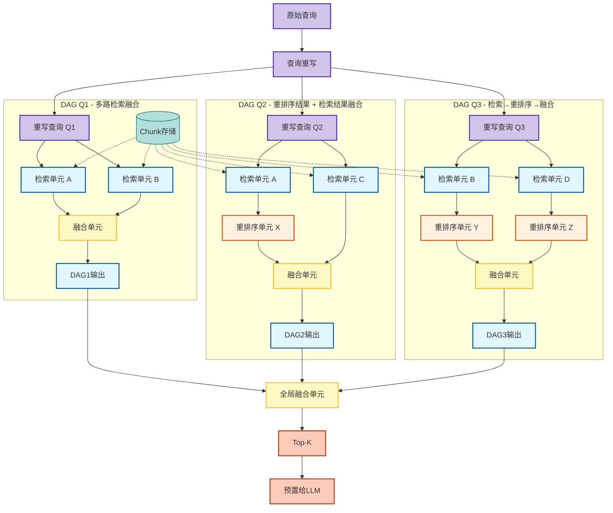

```mermaid
graph TD
    %% 样式定义
    classDef retrieve fill:#e1f5fe,stroke:#01579b,stroke-width:2px;
    classDef rerank fill:#fff3e0,stroke:#e65100,stroke-width:2px;
    classDef fusion fill:#fff9c4,stroke:#fbc02d,stroke-width:2px;
    classDef query fill:#d1c4e9,stroke:#512da8,stroke-width:2px;
    classDef llm fill:#ffccbc,stroke:#bf360c,stroke-width:2px;
    classDef chunk fill:#b2dfdb,stroke:#00695c,stroke-width:1px,dashed;

    Start["原始查询"]:::query --> Rewrite["查询重写"]:::query
    Rewrite --> Q1["重写查询 Q1"]:::query
    Rewrite --> Q2["重写查询 Q2"]:::query
    Rewrite --> Q3["重写查询 Q3"]:::query

    ChunkDB[("Chunk存储")]:::chunk

    subgraph DAG1 [DAG Q1 - 多路检索融合]
        Q1 --> R1A["检索单元 A"]:::retrieve
        Q1 --> R1B["检索单元 B"]:::retrieve
        ChunkDB -.-> R1A
        ChunkDB -.-> R1B
        R1A --> F1["融合单元"]:::fusion
        R1B --> F1
        F1 --> Out1["DAG1输出"]:::retrieve
    end

    subgraph DAG2 [DAG Q2 - 重排序结果 + 检索结果融合]
        Q2 --> R2A["检索单元 A"]:::retrieve
        Q2 --> R2C["检索单元 C"]:::retrieve
        ChunkDB -.-> R2A
        ChunkDB -.-> R2C
        R2A --> Re2["重排序单元 X"]:::rerank
        Re2 --> F2["融合单元"]:::fusion
        R2C --> F2
        F2 --> Out2["DAG2输出"]:::retrieve
    end

    subgraph DAG3 [DAG Q3 - 检索→重排序→融合]
        Q3 --> R3B["检索单元 B"]:::retrieve
        Q3 --> R3D["检索单元 D"]:::retrieve
        ChunkDB -.-> R3B
        ChunkDB -.-> R3D
        R3B --> Re3B["重排序单元 Y"]:::rerank
        R3D --> Re3D["重排序单元 Z"]:::rerank
        Re3B --> F3["融合单元"]:::fusion
        Re3D --> F3
        F3 --> Out3["DAG3输出"]:::retrieve
    end

    Out1 --> FinalFusion["全局融合单元"]:::fusion
    Out2 --> FinalFusion
    Out3 --> FinalFusion
    FinalFusion --> TopK["Top-K"]:::llm
    TopK --> LLM["预置给LLM"]:::llm
```